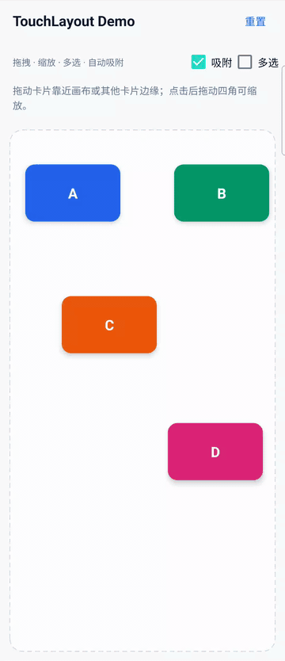

# TouchLayout Compose

一个纯 Jetpack Compose 实现的可交互布局容器，适用于海报、图表、仪表盘等可视化编辑场景。元素可以被选择、拖拽、缩放和组合移动，并在靠近画布边界或其他元素时自动吸附。

> 没有使用 `AndroidView` 包装旧控件，布局、状态、手势和绘制均由 Compose 实现。



## 功能

- 单选拖拽与四角缩放
- 多根手指同时拖动不同元素
- 多选、反选、组合拖动与组合缩放
- 父容器四边吸附
- 元素相邻边贴合与同侧边对齐
- 画布边界限制、选区控制点与虚线参考线
- 可配置编辑状态、吸附开关和吸附距离
- 状态驱动布局，操作完成回调便于持久化位置

## Demo 操作

1. 拖动卡片靠近画布或另一张卡片，观察自动吸附。
2. 点击卡片后拖动四角控制点进行缩放。
3. 开启“多选”，依次点击多张卡片，再拖动或缩放组合选区。
4. 使用“吸附”开关进行开启/关闭对比，点击“重置”恢复初始位置。

## 快速使用

项目已经拆分为可复用的 `:touchlayout` Android Library 和独立的 `:app` Demo：

```groovy
dependencies {
    implementation project(':touchlayout')
}
```

创建只包含身份与位置的元素状态。`Rect` 使用画布像素坐标，文字、颜色等业务数据由调用方按 `id` 管理：

```kotlin
val density = LocalDensity.current
val items = remember(density) {
    with(density) {
        listOf(
            TouchItemState(
                id = "card-a",
                initialBounds = Rect(
                    left = 20.dp.toPx(),
                    top = 44.dp.toPx(),
                    right = 140.dp.toPx(),
                    bottom = 116.dp.toPx(),
                ),
            ),
        )
    }
}
val touchLayoutState = rememberTouchLayoutState(items)
val touchLayoutConfig = remember {
    TouchLayoutConfig(snapThreshold = 12.dp)
}
```

在 Compose 中渲染任意内容：

```kotlin
TouchLayout(
    state = touchLayoutState,
    config = touchLayoutConfig,
    modifier = Modifier.fillMaxSize(),
    onChangeFinished = { change ->
        // change.type 区分 Move / Resize
        // 保存 change.items 中不可变的 id + bounds 快照
    },
) { item ->
    val card = cardsById.getValue(item.id)
    Card(
        modifier = Modifier.fillMaxSize(),
        colors = CardDefaults.cardColors(containerColor = card.color),
    ) {
        Box(Modifier.fillMaxSize(), contentAlignment = Alignment.Center) {
            Text(card.label)
        }
    }
}
```

配置交互：

```kotlin
touchLayoutState.setEditEnabled(true)
touchLayoutState.setSnapEnabled(true)
touchLayoutState.setSelectionMode(TouchSelectionMode.Multiple)
touchLayoutState.updateItemBounds("card-a", restoredBounds)
val snapshot = touchLayoutState.snapshot()
touchLayoutState.reset()
```

## 吸附规则

每次拖动都会分别计算 X、Y 两个方向的最近候选位置。阈值范围内支持：

- 当前元素左、右、上、下边贴合父容器边界
- 当前元素与其他元素的左边、右边、顶部或底部对齐
- 当前元素与其他元素的相邻边贴合

组合拖动使用整个组合包围矩形参与计算，并排除组合内部成员。详细过程见 [自动吸附算法](docs/SNAP_ALGORITHM.md)。

## 主要 API

| API | 说明 |
| --- | --- |
| `TouchLayout(state, config, colors, onChangeFinished, itemContent)` | 可交互 Compose 容器 |
| `TouchItemState(id, initialBounds)` | 与业务展示数据解耦的元素状态 |
| `TouchLayoutConfig` | 使用 Dp 配置吸附阈值、最小尺寸与控制点 |
| `TouchLayoutColors` | 配置选区、控制点与吸附参考线颜色 |
| `TouchLayoutChange` | 操作类型及发生变化元素的不可变快照 |
| `setEditEnabled(Boolean)` | 开启或关闭编辑交互 |
| `setSelectionMode(TouchSelectionMode)` | 切换单选/多选模式并清空旧选区 |
| `setSnapEnabled(Boolean)` | 开启或关闭自动吸附 |
| `selectedIds` | 当前选中的元素 ID |
| `snapshot()` | 获取全部元素当前布局快照 |
| `updateItemBounds(id, bounds)` | 从业务数据恢复指定元素位置 |
| `reset()` | 恢复初始位置并清空选择 |
| `clearSelection()` | 清空当前选区 |

## 构建运行

环境要求：

- Android Gradle Plugin 9.3.1
- Gradle 9.7.1
- Kotlin / Compose Compiler 2.4.10
- Compose BOM 2026.08.00（Compose 1.12 稳定版）
- JDK 17
- Android SDK 37（`compileSdk 37`，`targetSdk 36`）
- Android 6.0（API 23）及以上设备

```bash
./gradlew assembleDebug
./gradlew installDebug
```

Debug APK 输出目录：`app/build/outputs/apk/debug/`。

## 项目结构

```text
touchlayout/
└── src/main/java/com/jiashuai/touchlayout/
    ├── TouchLayoutState.kt           # 公共状态、配置和变更快照 API
    └── TouchLayout.kt                # Compose 容器、手势、绘制与吸附

app/
└── src/main/java/.../MainActivity.kt # 业务数据和 Demo UI

docs/
└── SNAP_ALGORITHM.md                  # 自动吸附算法说明
```
